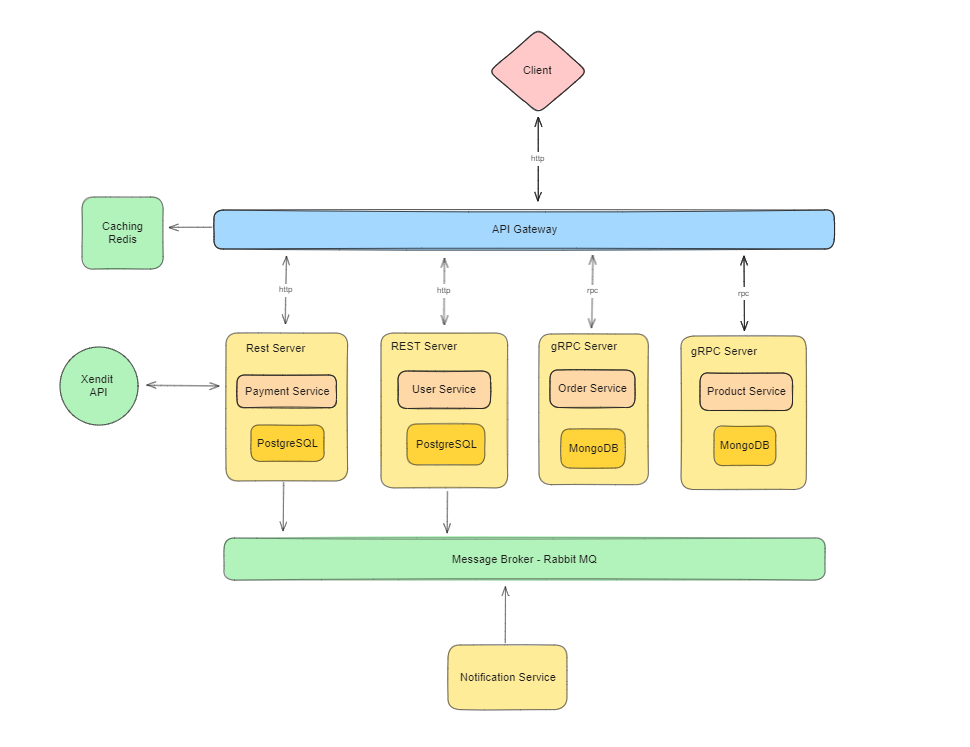
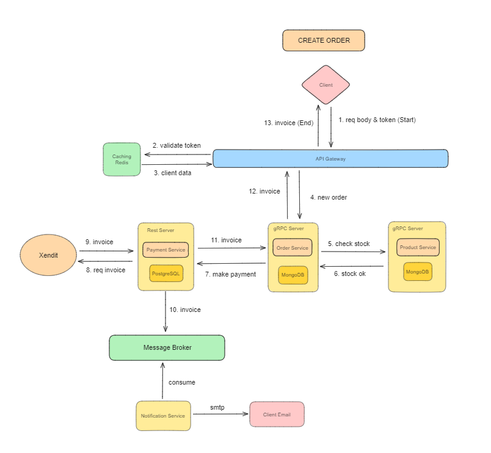
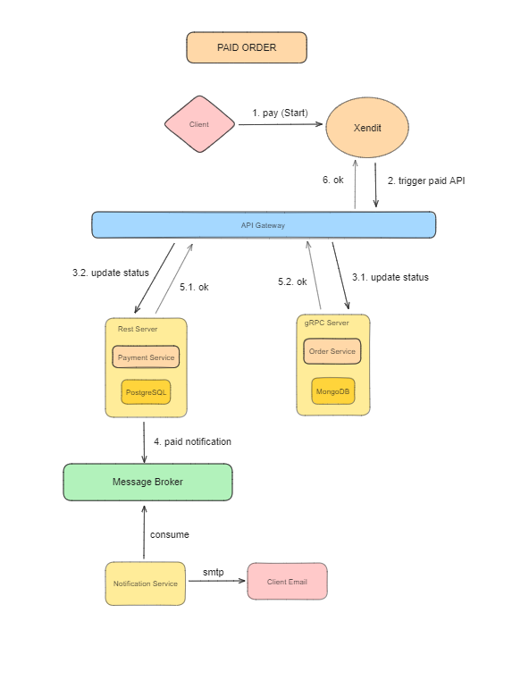
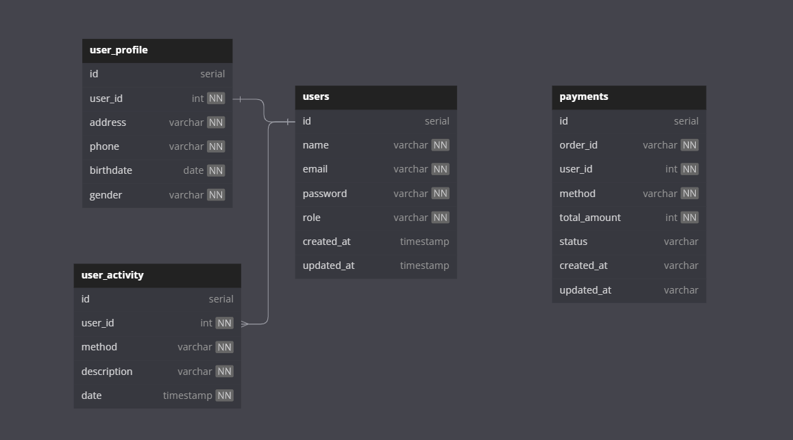
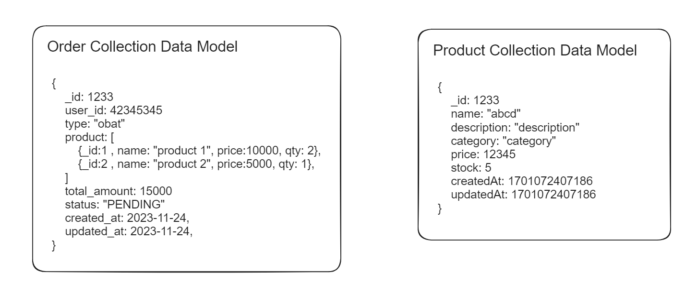

# WellnessLink

WellnessLink is a modern platform designed to streamline access to medications and healthcare services. It empowers users to conveniently purchase medications and access crucial healthcare information from the comfort of their homes.

## Features

### Medication Catalog

- Explore an extensive catalog of available medications.
- Access comprehensive information about each medication, including descriptions.

### User Authentication

- Secure login and registration functionalities for user accounts.
- Manage personal profiles securely.

### Ordering and Payment

- Easily select medications, add them to the cart, and complete secure payments.

## System Design

## Background Process

### Create Order

### Payment Process

## Database

### PostgreSQL

### MongoDB - Data Model

## Endpoints

### Products

- **GET /api/v1/products**: Get a list of products.
  - **Description**: Retrieve a list of available products.
  - **Example Request**: **`GET /api/v1/products`**
- **GET /api/v1/products/:id**: Get product details by ID.
  - **Description**: Get product details based on the provided ID.
  - **Example Request**: **`GET /api/v1/products/1`**
- **POST /api/v1/products**: Create a new product.
  - **Description**: Create a new product.
  - **Auth**: Required (Admin).
  - **Example Request**: **`POST /api/v1/products`**
- **PUT /api/v1/products/:id**: Update a product by ID.
  - **Description**: Update product details based on the provided ID.
  - **Auth**: Required (Admin).
  - **Example Request**: **`PUT /api/v1/products/1`**
- **DELETE /api/v1/products/:id**: Delete a product by ID.
  - **Description**: Delete a product based on the provided ID.
  - **Auth**: Required (Admin).
  - **Example Request**: **`DELETE /api/v1/products/1`**

### User

- **POST /api/v1/user/login**: User login.
  - **Description**: Log in a user and generate a token.
  - **Example Request**: **`POST /api/v1/user/login`**
- **POST /api/v1/user/register**: Register a new user.
  - **Description**: Register a new user.
  - **Example Request**: **`POST /api/v1/user/register`**
- **POST /api/v1/user/admin**: Register a new user.
  - **Description**: Register a new admin.
  - **Example Request**: **`POST /api/v1/user/admin`**
- **PUT /api/v1/user/profile/:id**: Update user profile by ID.
  - **Description**: Update user profile based on the provided ID.
  - **Example Request**: **`PUT /api/v1/user/profile/1`**
- **GET /api/v1/user/profile/:id**: Get user profile by ID.
  - **Description**: Get user profile based on the provided ID.
  - **Example Request**: **`GET /api/v1/user/profile/1`**

### Order

- **POST /api/v1/order**: Create a product order.
  - **Description**: Create a product order.
  - **Auth**: Required (User).
  - **Example Request**: **`POST /api/v1/order`**
- **POST /api/v1/order/cancel/:id**: Cancel a product order.
  - **Description**: Cancel a specific order.
  - **Auth**: Required (User).
  - **Example Request**: **`/api/v1/order/cancel/1`**
- **GET /api/v1/order/:id**: Get order by ID.
  - **Description**: Retrieve details of a specific order.
  - **Example Request**: **`GET /api/v1/order/1`**
- **GET /api/v1/order/admin**: Get list of order.
  - **Description**: Get a list of all orders.
  - **Auth**: Required (Admin).
  - **Example Request**: **`GET /api/v1/order/admin`**
- **PUT /api/v1/order/admin/confirm/:id**: Confirm an order by ID.
  - **Description**: Confirm an order by ID.
  - **Auth**: Required (Admin).
  - **Example Request**: **`PUT /api/v1/order/admin/confirm/1`**

### Payment

- **GET /api/v1/payment/:id**: Get payment details by ID.
  - **Description**: Find payment details by invoice ID.
  - **Example Request**: **`GET /api/v1/payment/:1`**
- **GET /api/v1/payment/order/:id**: Find payment by order ID.
  - **Description**: Find payment details by order ID.
  - **Example Request**: **`GET /api/v1/payment/order/1`**
- **GET /api/v1/payment/user/:id**: Find payment by user ID.
  - **Description**: Find payment details by user ID.
  - **Example Request**: **`GET /api/v1/payment/user/1`**

## Notification Service

This service is designed to handle notifications for invoices and users via RabbitMQ messaging system. It provides functionalities to process invoices and user registrations, sending notifications accordingly.

### Features

### Invoice Notification

- The service processes incoming messages related to invoices received via RabbitMQ. It uses the data to generate email notifications containing invoice details, which are sent to the respective payer's email address.

### User Registration Notification

- Additionally, the service is capable of handling user registration notifications. It processes incoming messages about user registrations from RabbitMQ and sends email notifications confirming successful user registration.

## Highlights

- Payment Gateway (Xendit)
- Email Notification

## Tech Stacks

- Go
- Echo
- gRPC
- PostgreSQL
- MongoDB
- Redis
- JWT
- 3rd Party APIs (Xendit)
- SMTP
- REST
- Swagger
- Testify
